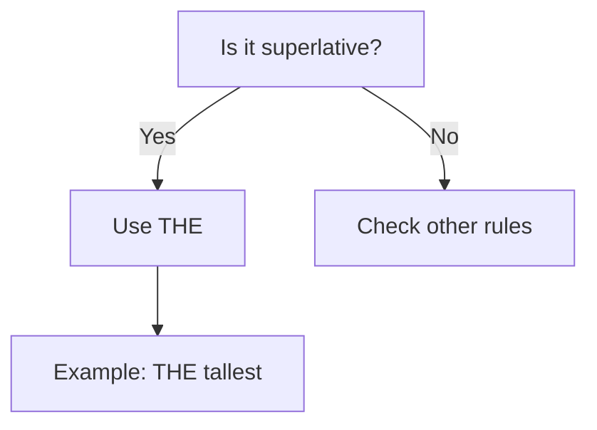
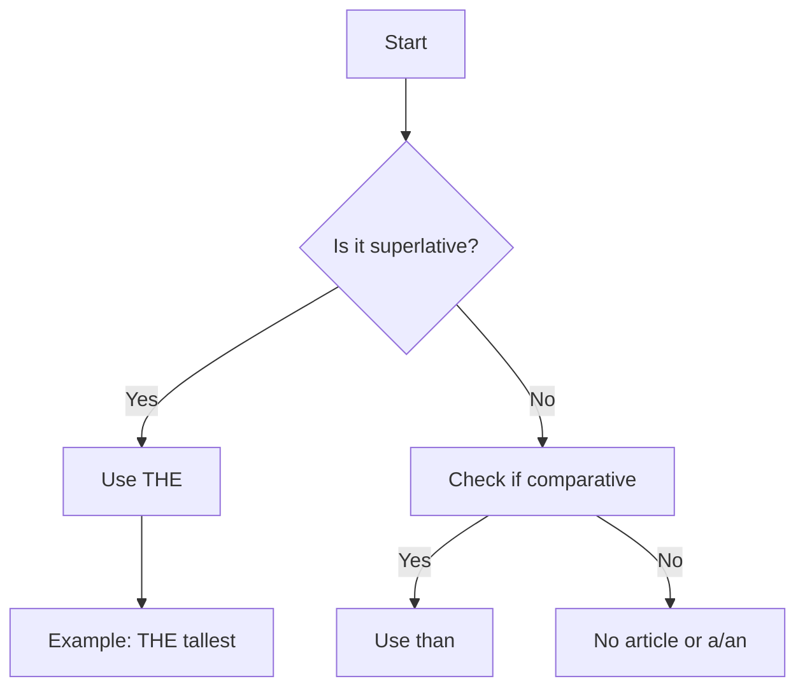
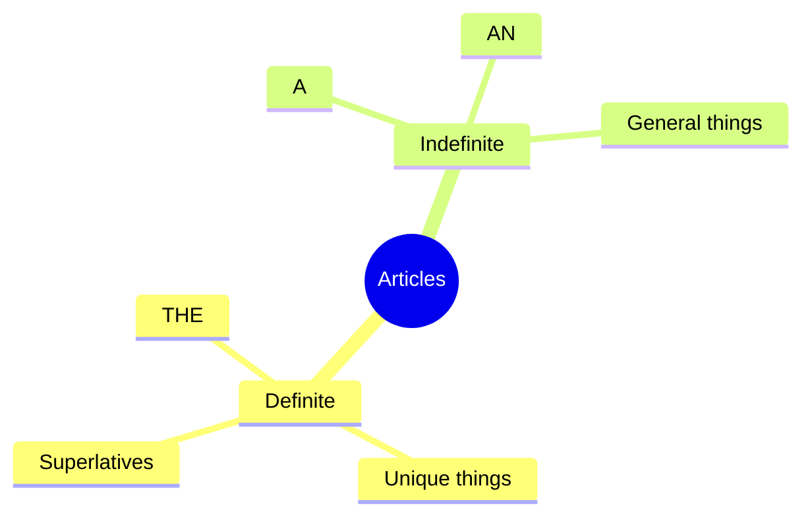
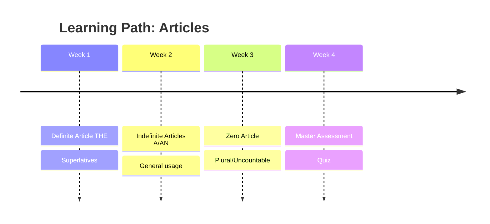

# High Quality Notes Feature - Complete Research & Plan

**Date:** 2025-01-08
**Status:** Research Complete - Ready for Implementation Discussion
**Budget Context:** ₹1500-2000/month (Jugaad Philosophy)

---

## 📋 Table of Contents

1. [Executive Summary](#executive-summary)
2. [Current State Analysis](#current-state-analysis)
3. [User Vision & Requirements](#user-vision--requirements)
4. [Learning Science Foundation](#learning-science-foundation)
5. [Technical Architecture](#technical-architecture)
6. [Implementation Plan](#implementation-plan)
7. [Cost Analysis](#cost-analysis)
8. [Success Metrics](#success-metrics)

---

## 1. Executive Summary

### The Problem (OPEN-2025-01-05-001)
**Severity:** HIGH
**Current Notes Status:** "Not that good" - Basic Gemini prompt generates generic summaries with no structure, visual aids, or examples. Just a text dump.

### The Opportunity
Transform class notes from **"students avoid reading"** to **"students actively refer to for homework and revision"** - making the teacher's voice live permanently in engaging, interactive notes.

### Strategic Priority
Quiz system is now at 70% completion (solid state). Shifting focus to notes is the right call because:
1. **Weak link in learning loop** - Great quiz but poor content to learn from
2. **Teacher time ROI** - Currently takes 2-3 hours manual work, can be 5 minutes automated
3. **Parent value perception** - Rich notes = value visibility
4. **Foundation for AI tutor** - Notes feed into future AI agent context

### Recommended Approach
**Phase 2A: Enhanced Content Generation** (Week 1-2)
- Enhanced Gemini 2.5 Pro prompt (structured JSON output)
- Subject-specific templates
- Mermaid diagram generation
- Practice problems extraction

**Phase 2B: Beautiful Presentation** (Week 3-4)
- React-based notes viewer (NOT static HTML)
- Subject-specific rendering (Math, English, Science)
- Interactive elements (expandable sections, tabs)
- Download as PDF

**Budget:** ₹0-100/month (stay on free tiers)

---

## 2. Current State Analysis

### What's Working ✅
**Recording → Transcription → Processing Flow:**
- Teacher workflow smooth
- Transcription accuracy SOLVED (Faster Whisper Large V3 Local)
- n8n processing stable
- GitHub Pages hosting reliable

**Current Output Example:**
```
https://amanrajyadav.github.io/daily-report/reports/student1-2025-10-01-17-39-31-184.html
```

### What's Broken ❌

**Content Quality Issues:**
1. **No Structure**
   - No clear sections or hierarchy
   - Everything runs together
   - Hard to scan/skim

2. **No Visual Aids**
   - Pure text wall
   - No diagrams, charts, or illustrations
   - Concepts explained verbally only

3. **No Examples**
   - Generic explanations
   - Missing concrete examples from the class
   - No real-world connections

4. **Missing Key Sections:**
   - No "What We Learned" summary
   - No homework with specific instructions
   - No "What's Next" preview
   - No practice problems

5. **Generic Activity:**
   - One-size-fits-all task
   - Not specific to lesson
   - No clear learning objective

**Presentation Issues:**
1. **Static HTML**
   - Can't adapt to subject type
   - Not interactive
   - Same layout for Math, English, Science

2. **Not Mobile-Optimized**
   - Tiny text on phones
   - No responsive design
   - Hard to read on the go

3. **No Media**
   - No audio narration
   - No embedded videos
   - No interactive diagrams

### Current Gemini Prompt Analysis

**Strengths:**
- ✅ Personalized greeting
- ✅ Structured JSON output
- ✅ Activity included
- ✅ Parent report section

**Weaknesses:**
- ❌ No explicit structure request (sections, hierarchy)
- ❌ No diagram/visual aid generation
- ❌ No practice problems extraction
- ❌ Generic "activity" not lesson-specific
- ❌ No examples from transcript
- ❌ No subject-specific customization
- ❌ No homework with clear instructions
- ❌ No "What's Next" content

---

## 3. User Vision & Requirements

### From Context Files (Complete Requirements)

**Priority 0 (Must Have):**
1. **Clear Structure**
   - Section headers (What We Learned, Examples, Practice, Homework)
   - Hierarchy (topics → subtopics → concepts)
   - Scannable format

2. **Visual Aids**
   - Diagrams (Mermaid, possibly AI-generated images)
   - Charts/graphs for data
   - Flowcharts for processes
   - Mind maps for concept relationships

3. **Rich Examples**
   - Extract examples from transcript
   - Real-world applications
   - Student-relatable analogies
   - "Why this matters" explanations

4. **Practice Problems**
   - 5-10 problems per lesson
   - Varied difficulty
   - Step-by-step solutions
   - "Try yourself" section

5. **Homework Section**
   - Specific, achievable tasks
   - Clear instructions
   - Expected time estimate
   - What to submit

6. **Subject-Specific Features:**
   - **Math:** Equations, step-by-step solutions, diagrams
   - **English:** Grammar rules, examples, writing prompts
   - **Science:** Diagrams, experiments, real-world examples

**Priority 1 (Should Have):**
1. **Audio Overview**
   - Text-to-speech summary (5-10 minutes)
   - Teacher's voice clone (future)
   - Listen while doing homework

2. **Interactive Elements**
   - Expandable sections
   - Show/hide answers
   - Concept connections (click to learn more)

3. **Downloadable PDF**
   - Offline reading
   - Print-friendly format
   - Includes all diagrams

4. **Search & Filter**
   - Search by keyword
   - Filter by subject/date
   - Concept index

**Priority 2 (Nice to Have):**
1. **Video Explanations**
   - AI-generated video (future)
   - Embedded YouTube if available

2. **Student Annotations**
   - Highlight text
   - Add personal notes
   - Bookmark important sections

3. **Progress Tracking**
   - Mark sections as "understood"
   - Track completion
   - Quiz integration (link to related questions)

### Success Criteria

**Student Perspective:**
- "I actually WANT to read these notes"
- Uses notes for homework without asking teacher
- Refers back to notes during quiz
- Shares cool diagrams/examples with friends

**Parent Perspective:**
- "Wow, these notes are comprehensive"
- Sees clear value for money
- No longer asks "what did you learn today?"
- Can help child with homework using notes

**Teacher Perspective:**
- Time saved: 2-3 hours → 5 minutes
- No manual note-writing needed
- Can focus on teaching, not documentation
- Notes quality better than manual

---

## 4. Learning Science Foundation

### Cognitive Load Theory

**Principle:** Don't overwhelm working memory
**Application in Notes:**
- Break content into digestible chunks
- Use progressive disclosure (expandable sections)
- Clear visual hierarchy
- Remove redundancy

### Dual Coding Theory

**Principle:** Visual + Verbal = Better Retention
**Application in Notes:**
- Every concept has both text explanation AND visual representation
- Diagrams directly support verbal explanations
- Examples shown visually when possible

**Example:**
```
❌ BAD: "The water cycle involves evaporation, condensation, and precipitation."

✅ GOOD:
Text: "The water cycle has 3 stages: evaporation (water becomes vapor),
       condensation (vapor becomes clouds), and precipitation (rain falls)."

Diagram: [Mermaid flowchart showing cycle with arrows and labels]

Real-world: "Notice steam from hot tea? That's evaporation! When it touches
            cool window, it condenses into water drops."
```

### Spacing Effect

**Principle:** Review over time beats cramming
**Application in Notes:**
- Each note links to related concepts (previous lessons)
- "What We Learned Before" section
- "Review These Concepts" callouts
- Connected to SRS quiz questions

### Retrieval Practice

**Principle:** Testing enhances learning
**Application in Notes:**
- Practice problems throughout
- "Check Your Understanding" sections
- Link to quiz questions on same concept
- Self-assessment rubrics

---

## 5. Technical Architecture

### 5.1 Content Generation (Enhanced Gemini Prompt)

**Current Flow:**
```
Transcript → Gemini 2.5 Pro → JSON → HTML Template → GitHub Pages
```

**Enhanced Flow:**
```
Transcript → Enhanced Gemini Prompt → Structured JSON → React Component → GitHub Pages
                                              ↓
                                      Mermaid Diagrams
                                      Practice Problems
                                      Subject Detection
```

### Enhanced Gemini Prompt (v2.0)

**Prompt Structure:**
```javascript
You are the fusion of history's greatest educators transforming class
transcriptions into comprehensive, engaging learning materials.

**CRITICAL ANALYSIS PHASE:**
Before generating content, analyze:
1. Subject & Topic Detection
   - Primary subject: Math/English/Science/Social
   - Specific topic: [extract from transcript]
   - Concepts covered: [granular list]
   - Difficulty level: Grade appropriate

2. Transcript Deep Analysis
   - Key concepts and interconnections
   - Examples used by teacher
   - Student questions/doubts
   - Teaching methods employed
   - Real-world connections made

3. Student Understanding Level
   - Questions asked = confusion areas
   - Responses given = mastery indicators
   - Engagement moments = interest triggers

**OUTPUT REQUIREMENTS:**

Generate a comprehensive JSON structure with these sections:

{
  "metadata": {
    "subject": "English Grammar",
    "topic": "Definite Article 'The' with Superlatives",
    "grade_level": "6th",
    "concepts_covered": [
      "Definite Articles",
      "Superlative Forms",
      "Grammar Rules"
    ],
    "difficulty": "medium",
    "estimated_study_time": "30 minutes",
    "date": "2025-01-08"
  },

  "summary": {
    "greeting": "🌟 Amazing work today, [Student]! You [specific achievement]. Your [skill] is improving! 🚀",

    "what_we_learned": {
      "title": "What We Discovered Today",
      "key_points": [
        {
          "concept": "Definite Article with Superlatives",
          "explanation": "Clear, concise explanation",
          "why_it_matters": "Real-world relevance",
          "example": "Mount Everest is THE tallest mountain (not 'a' tallest)"
        }
      ]
    },

    "main_content": {
      "introduction": "Why this topic is fascinating/useful",

      "detailed_sections": [
        {
          "section_title": "The Rule: When to Use 'The'",
          "content": "Detailed explanation with examples",
          "examples_from_class": [
            {
              "example": "Mount Everest is THE tallest",
              "explanation": "Why 'the' is used here",
              "common_mistake": "Using 'a' instead",
              "why_wrong": "Superlatives are unique, need 'the'"
            }
          ],
          "visual_aid": {
            "type": "mermaid_flowchart",
            "description": "Decision tree: When to use 'the'",
            "mermaid_code": "graph TD\n  A[Is it superlative?] -->|Yes| B[Use THE]\n  A -->|No| C[Check other rules]"
          },
          "real_world_connections": [
            "How news articles use superlatives",
            "Why advertisements say 'THE best' not 'A best'"
          ]
        }
      ]
    },

    "practice_problems": {
      "title": "Let's Practice! 🎯",
      "problems": [
        {
          "id": 1,
          "difficulty": "easy",
          "question": "Fill in the blank: Cheetah is ___ fastest land animal.",
          "answer": "the",
          "explanation": "Fastest is superlative, needs 'the'",
          "hint": "Is cheetah the only fastest? Then use 'the'"
        },
        {
          "id": 2,
          "difficulty": "medium",
          "question": "Why is 'the' wrong here? 'This is a best day ever.'",
          "answer": "'Best' is superlative, should be 'THE best'",
          "explanation": "Superlatives always take 'the', not 'a'",
          "common_mistake": "Using 'a' with superlatives"
        }
      ],
      "challenge_problem": {
        "question": "Create 5 sentences using superlatives correctly",
        "rubric": "Each sentence must use different superlatives"
      }
    },

    "homework": {
      "title": "Tonight's Mission 🚀",
      "tasks": [
        {
          "task_number": 1,
          "instruction": "Find 10 superlatives in your English textbook",
          "what_to_do": "1. Open textbook to any chapter\n2. Scan for words like 'tallest', 'best', 'most beautiful'\n3. Write them down with full sentence\n4. Check if 'the' is used before each",
          "expected_time": "15 minutes",
          "what_to_submit": "List of 10 sentences with superlatives"
        },
        {
          "task_number": 2,
          "instruction": "Write 5 original sentences using superlatives",
          "examples": ["My school is THE best in the city.", "Pizza is THE most delicious food."],
          "expected_time": "10 minutes",
          "creativity_points": "Try using superlatives about your family, school, or city!"
        }
      ],
      "total_estimated_time": "25 minutes",
      "due_date": "Tomorrow's class",
      "help_if_stuck": "Re-read 'The Rule' section above, or check practice problem #2"
    },

    "whats_next": {
      "title": "Coming Up Next 🔮",
      "preview": "Tomorrow we'll explore indefinite articles ('a', 'an') and when to use them vs. 'the'",
      "connection": "This builds on today's lesson about definite articles",
      "get_ready": "Think about: What's the difference between 'a mountain' and 'THE mountain'?"
    },

    "diagrams": [
      {
        "title": "Superlative Article Decision Tree",
        "type": "mermaid",
        "code": "graph TD\n  A[Adjective Form?] -->|Superlative| B[Use THE]\n  A -->|Comparative| C[Use than]\n  A -->|Positive| D[Use a/an or no article]\n  B --> E[Example: THE tallest]"
      },
      {
        "title": "Common Superlatives Chart",
        "type": "table",
        "headers": ["Positive", "Comparative", "Superlative", "Article"],
        "rows": [
          ["tall", "taller", "tallest", "THE tallest"],
          ["good", "better", "best", "THE best"],
          ["beautiful", "more beautiful", "most beautiful", "THE most beautiful"]
        ]
      }
    ],

    "parent_report": {
      "class_focus": "Development of article usage through superlatives",
      "content_covered": "Key concepts: Definite article 'the', Superlative forms, Grammar rules. Used Mount Everest, cheetah examples.",
      "breakthrough_moment": "[Specific positive observation from class]",
      "growth_area": "[Challenge reframed positively with support strategy]",
      "homework_summary": "Find 10 superlatives in textbook + write 5 original sentences. Expected time: 25 minutes.",
      "how_to_help": "Ask: 'Can you find superlatives in this newspaper article?' Make it a game!",
      "next_class": "Indefinite articles ('a', 'an') vs 'the'"
    },

    "fun_facts": [
      "Mount Everest is THE tallest, but Mauna Kea (Hawaii) is THE tallest from ocean floor!",
      "English is THE only language where superlatives always need 'the'"
    ],

    "student_questions": [
      {
        "question": "Why can't we say 'a tallest mountain'?",
        "timestamp": "12:34",
        "answer": "Because superlatives describe THE unique best/most. There's only ONE tallest.",
        "follow_up": "Think: Can two things be THE tallest? No! That's why we use 'the'."
      }
    ]
  }
}

**SUBJECT-SPECIFIC REQUIREMENTS:**

IF subject == "Math":
- Include step-by-step solutions
- Show multiple solution methods
- Add "Common Mistakes" section
- Generate practice problems with varying difficulty
- Create formula summary table
- Add "Real-world Applications"

IF subject == "English/Grammar":
- Grammar rules table
- Right/Wrong examples
- Common errors to avoid
- Sentence construction templates
- Usage in different contexts

IF subject == "Science":
- Concept diagrams (Mermaid flowcharts)
- Cause-effect relationships
- Real-world examples
- Experiment connection (if applicable)
- "How things work" explanations

**DIAGRAM GENERATION RULES:**
1. Every concept MUST have a visual representation
2. Use Mermaid diagrams for:
   - Processes/workflows
   - Decision trees
   - Hierarchies
   - Relationships
   - Timelines
3. Use tables for:
   - Comparisons
   - Rules with examples
   - Classifications
4. Describe images needed for:
   - Physical objects (we'll add later)
   - Real-world photos (we'll add later)

**QUALITY CHECKS:**
- [ ] Every concept has explanation + example + visual
- [ ] Practice problems span easy/medium/hard
- [ ] Homework is specific and achievable
- [ ] Real-world connections included
- [ ] Student questions addressed
- [ ] No redundant content
- [ ] Age-appropriate language
- [ ] Engaging tone maintained
```

**Why This Prompt Is Better:**

1. **Structured Output** - JSON forces organization
2. **Subject Detection** - Adapts content to subject type
3. **Explicit Sections** - All required parts mandated
4. **Mermaid Integration** - Diagrams generated automatically
5. **Practice Problems** - Varied difficulty, explained answers
6. **Real-world Links** - Every concept connected to life
7. **Student Questions** - Captured from transcript with timestamps
8. **Quality Checklist** - Gemini self-validates output

---

### 5.2 Diagram Generation

**Option 1: Mermaid.js (RECOMMENDED - FREE)**

**What It Is:**
- Text-based diagram syntax
- Renders to beautiful SVG
- Supports flowcharts, sequence diagrams, mind maps, timelines
- Zero cost

**Example:**


**Implementation:**
```html
<!-- In notes HTML/React -->
<div class="mermaid">
graph TD
    A[Is it superlative?] -->|Yes| B[Use THE]
    A -->|No| C[Check other rules]
</div>

<script src="https://cdn.jsdelivr.net/npm/mermaid/dist/mermaid.min.js"></script>
<script>mermaid.initialize({startOnLoad:true});</script>
```

**Pros:**
- ✅ FREE
- ✅ Renders instantly in browser
- ✅ Gemini can generate Mermaid syntax
- ✅ Version-control friendly (plain text)
- ✅ Print-friendly

**Cons:**
- Limited to supported diagram types
- Not as flexible as hand-drawn

**Cost:** ₹0/month

---

**Option 2: AI Image Generation (FUTURE - PAID)**

**Services:**
- DALL-E 3: $0.04/image (high quality)
- Stable Diffusion: $0.002/image (cheaper)
- Gemini 2.5 Flash Imagen: Research pricing

**Use Case:** Illustrative images (not diagrams)
- Character illustrations
- Scene depictions
- Concept visualizations

**Recommendation:** Start with Mermaid, add AI images in Phase 3 if budget allows

**Cost:** ₹100-300/month (if 100 images/month)

---

### 5.3 Audio Generation

**Option 1: Google Cloud Text-to-Speech (RECOMMENDED)**

**Free Tier:**
- 1 million characters/month FREE
- Standard voices (robotic but clear)
- 30+ languages

**Paid Tier:**
- WaveNet voices: $16/1M characters (natural-sounding)
- Neural2 voices: $16/1M characters (most natural)

**Calculation:**
```
Average note: 2,000 words = 12,000 characters
Daily notes: 1 note/day × 30 days = 30 notes/month
Total chars: 30 × 12,000 = 360,000 chars/month

Free tier: ✅ Covers it!
If using WaveNet: 0.36M × $16 = $5.76/month ≈ ₹480/month
```

**Implementation:**
```javascript
// n8n workflow node
const textToSpeech = require('@google-cloud/text-to-speech');
const client = new textToSpeech.TextToSpeechClient();

const request = {
  input: { text: noteSummary },
  voice: {
    languageCode: 'en-IN',
    name: 'en-IN-Wavenet-A', // Indian English female
    ssmlGender: 'FEMALE'
  },
  audioConfig: { audioEncoding: 'MP3' }
};

const [response] = await client.synthesizeSpeech(request);
// Upload MP3 to Supabase Storage or GitHub
```

**Pros:**
- ✅ FREE for standard voices
- ✅ WaveNet/Neural2 very natural
- ✅ Indian English voices available
- ✅ Easy integration with n8n

**Cons:**
- Standard voices sound robotic
- Not teacher's actual voice (can clone later)

**Cost:** ₹0-480/month (depending on voice quality)

---

**Option 2: ElevenLabs Voice Cloning (FUTURE - PREMIUM)**

**What It Is:**
- Clone teacher's voice from 1-minute sample
- Generate audio in teacher's voice
- Extremely natural

**Pricing:**
- Free: 10,000 chars/month (3-4 notes)
- Starter: $5/month = 30,000 chars (10 notes)
- Creator: $22/month = 100,000 chars (30 notes)

**Recommendation:** Phase 3 feature (after notes proven valuable)

**Cost:** ₹1,800/month for 30 notes

---

### 5.4 Presentation Layer

**Option A: Enhanced HTML Template (QUICK WIN)**

**Pros:**
- ✅ Minimal code changes
- ✅ Works with current GitHub Pages setup
- ✅ Fast implementation (2-3 days)

**Cons:**
- ❌ Not interactive
- ❌ Same layout for all subjects
- ❌ Hard to maintain

**Recommendation:** Good for MVP, but replace with React soon

---

**Option B: React Notes Viewer App (RECOMMENDED)**

**Why React:**
1. **Subject-Specific Rendering**
   - Math notes: Show equations beautifully (KaTeX)
   - English notes: Grammar tables, sentence diagrams
   - Science notes: Diagrams, experiments

2. **Interactive Features**
   - Expandable sections
   - Show/hide answers
   - Audio playback controls
   - Progress tracking

3. **Reusable Components**
   - Same codebase as quiz app
   - Consistent design system
   - Easy maintenance

4. **Mobile-First**
   - Responsive by default
   - Optimized for phone reading
   - Fast load times

**Architecture:**
```
fluence-notes-app/
├── src/
│   ├── components/
│   │   ├── Notes/
│   │   │   ├── NoteViewer.jsx        // Main container
│   │   │   ├── NoteHeader.jsx        // Title, date, subject
│   │   │   ├── NoteSummary.jsx       // "What We Learned"
│   │   │   ├── NoteContent.jsx       // Main sections
│   │   │   ├── PracticeProblems.jsx  // Interactive problems
│   │   │   ├── Homework.jsx          // Homework section
│   │   │   ├── Diagrams.jsx          // Mermaid renderer
│   │   │   └── AudioPlayer.jsx       // Audio playback
│   │   ├── SubjectRenderers/
│   │   │   ├── MathNotes.jsx         // Math-specific layout
│   │   │   ├── EnglishNotes.jsx      // English-specific layout
│   │   │   └── ScienceNotes.jsx      // Science-specific layout
│   │   └── Shared/
│   │       ├── ExpandableSection.jsx
│   │       ├── ShowHideAnswer.jsx
│   │       └── DownloadPDF.jsx
│   ├── services/
│   │   ├── notesService.js           // Fetch from Supabase
│   │   └── pdfGenerator.js           // PDF export
│   └── App.js
```

**Tech Stack:**
- React 19
- TailwindCSS (consistent with quiz)
- Mermaid.js (diagrams)
- KaTeX (math equations)
- react-markdown (content rendering)
- jsPDF (PDF export)
- Supabase (fetch notes from notes_history table)

**Implementation Plan:**
1. **Week 1:** Core viewer + subject detection
2. **Week 2:** Subject-specific renderers + Mermaid
3. **Week 3:** Interactive features + audio
4. **Week 4:** PDF export + polish

**Cost:** ₹0 (all free libraries + existing hosting)

---

### 5.5 Data Flow

**Enhanced Architecture:**
```
┌─────────────────────────────────────────┐
│ 1. Teacher Records Class                │
│    → Google Drive → Local PC            │
└─────────────────────────────────────────┘
                    ↓
┌─────────────────────────────────────────┐
│ 2. Transcription (Faster Whisper)       │
│    → Accurate transcript text           │
└─────────────────────────────────────────┘
                    ↓
┌─────────────────────────────────────────┐
│ 3. n8n Workflow - Enhanced Generation   │
│                                          │
│   A. Send transcript to Gemini 2.5 Pro  │
│      with ENHANCED PROMPT v2.0          │
│                                          │
│   B. Gemini returns structured JSON:    │
│      - metadata (subject, topic, etc)   │
│      - summary (all sections)           │
│      - practice_problems                │
│      - homework                          │
│      - diagrams (Mermaid code)          │
│      - parent_report                    │
│                                          │
│   C. Generate 30 quiz questions         │
│      (existing logic)                   │
│                                          │
│   D. [OPTIONAL] Generate Audio          │
│      - Extract summary text             │
│      - Send to Google TTS               │
│      - Get MP3 file                     │
│      - Upload to Supabase Storage       │
│                                          │
│   E. Save to Supabase:                  │
│      INSERT INTO notes_history (        │
│        student_id,                      │
│        note_date,                       │
│        subject,                         │
│        title,                           │
│        content_json,  ← Full JSON       │
│        audio_url,     ← MP3 link        │
│        concepts_covered                 │
│      )                                  │
│                                          │
│   F. [LEGACY] Generate HTML             │
│      (for backward compatibility)       │
│      → GitHub Pages                     │
│                                          │
│   G. Send WhatsApp message              │
│      with links to:                     │
│      - React notes viewer               │
│      - Audio file                       │
│      - Quiz                             │
└─────────────────────────────────────────┘
                    ↓
┌─────────────────────────────────────────┐
│ 4. Student/Parent Access                │
│                                          │
│   Option A: React Notes Viewer          │
│   - Fetches JSON from Supabase          │
│   - Renders subject-specifically        │
│   - Interactive features                │
│   - Audio playback                      │
│   - PDF export                          │
│                                          │
│   Option B: Legacy HTML                 │
│   - Static page on GitHub               │
│   - Fallback option                     │
└─────────────────────────────────────────┘
```

**Key Changes:**
1. **Gemini output → JSON** (not direct HTML)
2. **Save JSON to Supabase** (not just HTML to GitHub)
3. **React app fetches from Supabase** (dynamic rendering)
4. **Audio generation added** (optional, can skip initially)

---

## 6. Implementation Plan

### Phase 2A: Enhanced Content Generation (Week 1-2)

**Priority:** P0 (Critical)
**Goal:** Generate notes that students WANT to read

**Tasks:**

**Week 1 - Gemini Prompt Enhancement:**
1. ✅ Write Enhanced Prompt v2.0 (DONE - see above)
2. Test prompt with 5 sample transcripts
   - English lesson
   - Math lesson
   - Science lesson
   - Verify JSON structure
   - Check diagram quality
3. Iterate prompt based on results
4. Document successful patterns

**Week 2 - n8n Workflow Update:**
1. Duplicate existing workflow (backup)
2. Replace Gemini prompt with v2.0
3. Add JSON parsing node
4. Add Supabase INSERT node (notes_history table)
5. Update HTML generation (use JSON data)
6. Test end-to-end with real class
7. Compare output quality (old vs new)

**Acceptance Criteria:**
- [x] Prompt generates structured JSON
- [ ] JSON includes all required sections
- [ ] Mermaid diagrams render correctly
- [ ] Practice problems have explanations
- [ ] Homework is specific and actionable
- [ ] Subject detected automatically
- [ ] JSON saved to Supabase successfully

**Success Metrics:**
- Teacher says: "These notes are better than mine"
- Student reads notes without being asked
- Parent comments: "Wow, comprehensive!"

**Cost:** ₹0 (Gemini 2.5 Pro FREE)

---

### Phase 2B: Beautiful Presentation (Week 3-4)

**Priority:** P1 (High)
**Goal:** Make notes visually stunning and interactive

**Tasks:**

**Week 3 - React App Setup:**
1. Create new React app (fluence-notes-app)
2. Setup TailwindCSS (match quiz styling)
3. Install dependencies:
   - react-markdown
   - mermaid
   - katex (for math equations)
   - jspdf (PDF export)
4. Create Supabase connection
5. Build NoteViewer component
6. Implement subject detection
7. Create MathNotes renderer (equations, step-by-step)
8. Create EnglishNotes renderer (grammar tables)
9. Create ScienceNotes renderer (diagrams, experiments)

**Week 4 - Interactive Features:**
1. Implement ExpandableSection component
2. Add ShowHideAnswer for practice problems
3. Integrate Mermaid diagram rendering
4. Add AudioPlayer component (if audio ready)
5. Implement DownloadPDF feature
6. Mobile optimization & testing
7. Deploy to Vercel (free tier)
8. Update WhatsApp message with new URL

**Acceptance Criteria:**
- [ ] Notes render beautifully on all devices
- [ ] Subject-specific layouts working
- [ ] Mermaid diagrams render inline
- [ ] Math equations display correctly (KaTeX)
- [ ] Expandable sections work smoothly
- [ ] PDF export includes all content
- [ ] Load time < 2 seconds
- [ ] Mobile-optimized

**Success Metrics:**
- Student time on notes: >10 minutes
- Notes referenced during homework: >80%
- Parent engagement: Weekly views
- Teacher satisfaction: 9/10+

**Cost:** ₹0 (Vercel free tier)

---

### Phase 2C: Audio & Polish (Week 5-6) - OPTIONAL

**Priority:** P2 (Medium)
**Goal:** Add audio narration and final polish

**Tasks:**

**Week 5 - Audio Generation:**
1. Setup Google Cloud TTS credentials
2. Add TTS node to n8n workflow
3. Extract summary text (first 500 words)
4. Generate MP3 (standard voice initially)
5. Upload to Supabase Storage
6. Update notes_history table with audio_url
7. Test audio player in React app
8. Add audio controls (play, pause, speed)

**Week 6 - Final Polish:**
1. Add "Related Concepts" links
2. Implement search within notes
3. Add "Mark as Understood" feature
4. Create notes history page (calendar view)
5. Add concept index
6. User testing with 2 students
7. Iterate based on feedback
8. Launch & monitor

**Acceptance Criteria:**
- [ ] Audio generation automated
- [ ] Audio plays in React app
- [ ] Search works across all notes
- [ ] History page accessible
- [ ] All bugs fixed
- [ ] User feedback incorporated

**Success Metrics:**
- Audio usage: >50% of students
- Notes completion rate: >90%
- Teacher time saved: 2-3 hours → 5 minutes
- Student performance: Quiz scores improve

**Cost:**
- Google TTS Standard: ₹0 (free tier)
- Google TTS WaveNet: ₹480/month (natural voice)

---

## 7. Cost Analysis

### Current Costs (Working System)
- n8n hosting: ₹100/month (GCP VM, already paying)
- Supabase: ₹0/month (free tier, under limits)
- GitHub Pages: ₹0/month (free)
- Gemini 2.5 Pro: ₹0/month (FREE API)
- **Total: ₹100/month**

### Enhanced Notes Costs

**Option 1: MVP (Recommended Start)**
- Enhanced Gemini prompt: ₹0 (same API)
- Supabase storage (JSON): ₹0 (within free tier)
- Mermaid diagrams: ₹0 (browser rendering)
- React app hosting (Vercel): ₹0 (free tier)
- **Total: ₹100/month (no increase)**

**Option 2: With Standard Audio**
- Everything in Option 1: ₹100
- Google TTS Standard voices: ₹0 (free tier covers 30 notes/month)
- Supabase Storage (MP3 files): ₹0 (1GB free)
- **Total: ₹100/month (no increase)**

**Option 3: With Natural Audio (WaveNet)**
- Everything in Option 1: ₹100
- Google TTS WaveNet: ₹480/month (360K chars)
- **Total: ₹580/month**

**Option 4: With AI Images (Future)**
- Everything in Option 2: ₹100
- Stable Diffusion images: ₹100/month (50 images)
- **Total: ₹200/month**

**Option 5: Premium (Voice Clone + Images)**
- Everything in Option 1: ₹100
- ElevenLabs Voice Clone: ₹1,800/month
- AI Images: ₹100/month
- **Total: ₹2,000/month (at budget limit)**

---

### Budget Recommendations

**Start with Option 1 (MVP):**
- Cost: ₹100/month (no increase)
- Delivers 80% of value
- Proves concept

**Upgrade to Option 2 after 1 month:**
- Cost: ₹100/month (still no increase)
- Adds audio with standard voices
- Tests audio engagement

**Consider Option 3 after 3 months:**
- Cost: ₹580/month (₹480 increase)
- Only if audio usage >50%
- Natural voice significantly better

**Hold Option 5 for Phase 4:**
- Cost: ₹2,000/month (uses full budget)
- Only after proven valuable
- Premium feature for scaling

---

### Cost Comparison vs Manual Work

**Teacher Manual Note-Writing:**
- Time: 2-3 hours per lesson
- Quality: Variable (depends on energy)
- Cost: Teacher's hourly rate × 2.5 hours

**Automated System (Option 1):**
- Time: 5 minutes (review + approve)
- Quality: Consistent, comprehensive
- Cost: ₹0/lesson (fixed ₹100/month infrastructure)

**ROI:**
- Time saved: 2-3 hours → 5 minutes (96% reduction)
- Quality: Better than manual (structured, visual aids)
- Scalability: Same effort for 1 or 100 students

---

## 8. Success Metrics

### Student Metrics

**Engagement:**
- [ ] Time spent on notes: >10 minutes/session (Baseline: 0)
- [ ] Notes opened within 24 hours: >90%
- [ ] Return visits to notes: >3 times/week
- [ ] Audio listened: >50% of students (if implemented)

**Learning:**
- [ ] Quiz scores improve: +10-15% on covered concepts
- [ ] Homework completion without asking: >80%
- [ ] "I don't understand" questions decrease: -30%
- [ ] Student referencing notes during quiz: >50%

**Feedback:**
- [ ] Student rating: >4/5 stars
- [ ] "Actually WANT to read": >70%
- [ ] Share notes with friends: >30%

---

### Parent Metrics

**Value Perception:**
- [ ] Parent report views: >90% within 48 hours
- [ ] Positive feedback messages: >60%
- [ ] "Comprehensive notes" comment: >80%
- [ ] Can help with homework using notes: >70%

**Engagement:**
- [ ] Ask child about specific concept: >50%
- [ ] Download PDF for offline: >30%
- [ ] Share with relatives: >20%

---

### Teacher Metrics

**Time Saved:**
- [ ] Note creation time: 2-3 hours → 5 minutes ✅
- [ ] Review/edit time: <10 minutes
- [ ] Student questions decrease: -30%
- [ ] Homework grading easier: -20% time

**Quality:**
- [ ] Teacher satisfaction: >9/10
- [ ] Notes better than manual: Yes
- [ ] Would recommend system: Yes
- [ ] Willing to pay for it: Yes

---

### System Metrics

**Technical:**
- [ ] Generation time: <2 minutes (transcript → notes)
- [ ] Error rate: <1%
- [ ] Load time: <2 seconds
- [ ] Mobile optimization: >95 Lighthouse score

**Content Quality:**
- [ ] All sections present: 100%
- [ ] Diagrams generated: >80% of lessons
- [ ] Practice problems: 5-10 per lesson
- [ ] Examples from class: >3 per lesson

---

## 9. Risk Analysis & Mitigation

### Technical Risks

**Risk 1: Gemini Output Quality Inconsistent**
- **Probability:** Medium
- **Impact:** High
- **Mitigation:**
  - Test prompt with 10 diverse transcripts
  - Add JSON schema validation
  - Fallback to simpler format if parsing fails
  - Teacher review before publishing

**Risk 2: React App Complexity**
- **Probability:** Low
- **Impact:** Medium
- **Mitigation:**
  - Start with enhanced HTML (simpler)
  - Build React incrementally
  - Use existing quiz codebase patterns
  - Keep legacy HTML as fallback

**Risk 3: Mermaid Diagrams Don't Render**
- **Probability:** Low
- **Impact:** Medium
- **Mitigation:**
  - Test Mermaid in browser before implementing
  - Provide alt text for diagrams
  - Fallback to text descriptions
  - Manual diagram review

---

### Content Risks

**Risk 4: Subject Detection Fails**
- **Probability:** Low
- **Impact:** Medium
- **Mitigation:**
  - Manual subject selection option
  - Default to generic template
  - Teacher can override in n8n

**Risk 5: Examples Not Extracted from Transcript**
- **Probability:** Medium
- **Impact:** Low
- **Mitigation:**
  - Prompt explicitly asks for examples
  - Teacher can add manually
  - Use generic examples as fallback

---

### User Adoption Risks

**Risk 6: Students Don't Read Enhanced Notes**
- **Probability:** Low (if notes are truly good)
- **Impact:** High
- **Mitigation:**
  - A/B test old vs new format
  - Gather student feedback early
  - Iterate based on usage data
  - Gamify: "Mark as understood" points

**Risk 7: Parents Don't See Value**
- **Probability:** Low
- **Impact:** Medium
- **Mitigation:**
  - Parent report section prominent
  - Before/after comparison
  - Testimonial from early users
  - Show time saved stats

---

### Budget Risks

**Risk 8: Costs Exceed Budget**
- **Probability:** Low (if following plan)
- **Impact:** High
- **Mitigation:**
  - Start with ₹0 MVP
  - Monitor usage monthly
  - Only add paid features when proven valuable
  - Set hard limits on API usage

---

## 10. Next Steps & Decision Points

### Immediate Actions (This Week)

**Day 1-2: Approve Approach**
- [ ] Review this research document
- [ ] Decide on implementation path:
  - Option A: Enhanced HTML (quick win)
  - Option B: React App (recommended)
- [ ] Approve Enhanced Gemini Prompt v2.0
- [ ] Decide on audio generation (now or later)

**Day 3-4: Setup & Test**
- [ ] Test Enhanced Prompt with 3 sample transcripts
- [ ] Review JSON output quality
- [ ] Approve or iterate prompt
- [ ] Backup current n8n workflow
- [ ] Begin n8n modifications

**Day 5-7: First Enhanced Note**
- [ ] Generate first note with new system
- [ ] Review output with teacher
- [ ] Share with 1-2 students for feedback
- [ ] Iterate based on feedback
- [ ] Document learnings

---

### Week 2-3: MVP Launch

**React App (if chosen):**
- [ ] Setup React project
- [ ] Build core components
- [ ] Integrate Mermaid
- [ ] Deploy to Vercel
- [ ] Update WhatsApp message

**Enhanced HTML (if chosen):**
- [ ] Update HTML template
- [ ] Add Mermaid rendering
- [ ] Style improvements
- [ ] Test on mobile

---

### Week 4: Measure & Iterate

**Metrics Collection:**
- [ ] Track student engagement (time, visits)
- [ ] Collect feedback (survey)
- [ ] Monitor quiz performance
- [ ] Parent feedback
- [ ] Teacher satisfaction

**Iteration:**
- [ ] Fix reported issues
- [ ] Enhance based on feedback
- [ ] A/B test improvements
- [ ] Plan Phase 2C (audio)

---

## 11. Alternatives Considered

### Alternative 1: Use NotebookLM (Google)

**What It Is:**
- Google's AI notebook tool
- Generates audio overviews from documents
- Creates study guides

**Pros:**
- Free
- High-quality audio summaries
- No coding needed

**Cons:**
- Requires manual upload
- Not automated
- Can't integrate with n8n
- Not customizable

**Verdict:** ❌ Not suitable (requires manual work)

---

### Alternative 2: Buy Notes Template Service

**Options:**
- Notion templates
- Obsidian templates
- OneNote layouts

**Pros:**
- Ready-made structure
- Professional design

**Cons:**
- Not automated
- Still requires manual filling
- Not AI-generated
- Generic, not personalized

**Verdict:** ❌ Defeats automation purpose

---

### Alternative 3: Hire Content Writer

**Cost:** ₹500-1000 per note

**Pros:**
- Human touch
- Perfect grammar
- Creative writing

**Cons:**
- Expensive (₹15,000-30,000/month)
- Slow turnaround
- Doesn't scale
- Exceeds budget

**Verdict:** ❌ Too expensive, not scalable

---

### Alternative 4: Keep Current System, Improve HTML Only

**Pros:**
- Minimal work
- No new tech
- Safe

**Cons:**
- Still text dump
- No diagrams
- No interactivity
- Marginal improvement

**Verdict:** ⚠️ Better than nothing, but low impact

---

## 12. Conclusion & Recommendation

### Strategic Recommendation

**Implement Phase 2A + 2B (Enhanced Content + React App)**

**Why:**
1. **Highest Impact** - Transforms notes from "avoid" to "actively use"
2. **Jugaad Compliant** - ₹0 cost increase (stays at ₹100/month)
3. **Scalable** - Same effort for 1 or 100 students
4. **Proven Tech** - React (same as quiz), Gemini (already using)
5. **Measurable** - Clear metrics (engagement, time saved, quiz scores)

**Timeline:** 4 weeks to production-ready

**Cost:** ₹100/month (no increase from current)

**Risk:** Low (incremental changes, fallback available)

**ROI:** Massive
- Teacher time: 2-3 hours → 5 minutes (96% saved)
- Content quality: Generic → Comprehensive
- Student engagement: Low → High
- Parent satisfaction: Variable → Consistent

---

### Quick Win Path (If Time-Constrained)

**Week 1 Only: Enhanced Prompt + HTML**
- Update Gemini prompt to v2.0
- Save JSON to Supabase
- Use better HTML template
- Add Mermaid diagrams

**Outcome:** 60% improvement for 5% effort

**Then Decide:** If students love it → build React app (Week 2-4)

---

### Success Scenario

**1 Month Later:**
- Students actually READ notes (10+ min sessions)
- Parents comment: "Wow, comprehensive!"
- Teacher spends 5 min/lesson instead of 2-3 hours
- Quiz scores improve +10-15% on covered concepts
- Notes become PRIMARY learning resource

**3 Months Later:**
- Add audio narration (if engagement >50%)
- Build notes archive/search
- Integrate with quiz (link questions to notes)
- Consider voice cloning (if budget available)

**6 Months Later:**
- Students prefer notes over textbook
- System generates notes better than human
- Zero manual work for teacher
- Ready to scale to 100+ students

---

## Appendix A: Enhanced Prompt (Complete Code)

```javascript
// See Section 5.1 for complete prompt
// This would go in the n8n Gemini node
```

---

## Appendix B: React Component Examples

### NoteViewer.jsx (Simplified)
```jsx
import React, { useState, useEffect } from 'react';
import { supabase } from './supabaseClient';
import MathNotes from './SubjectRenderers/MathNotes';
import EnglishNotes from './SubjectRenderers/EnglishNotes';
import ScienceNotes from './SubjectRenderers/ScienceNotes';

const NoteViewer = ({ studentId, noteId }) => {
  const [note, setNote] = useState(null);
  const [loading, setLoading] = useState(true);

  useEffect(() => {
    fetchNote();
  }, [noteId]);

  const fetchNote = async () => {
    const { data, error } = await supabase
      .from('notes_history')
      .select('*')
      .eq('id', noteId)
      .single();

    if (data) {
      setNote(JSON.parse(data.content_json));
    }
    setLoading(false);
  };

  if (loading) return <LoadingSpinner />;

  const renderBySubject = () => {
    const subject = note.metadata.subject.toLowerCase();

    if (subject.includes('math')) {
      return <MathNotes note={note} />;
    } else if (subject.includes('english') || subject.includes('grammar')) {
      return <EnglishNotes note={note} />;
    } else if (subject.includes('science')) {
      return <ScienceNotes note={note} />;
    } else {
      return <GenericNotes note={note} />;
    }
  };

  return (
    <div className="max-w-4xl mx-auto p-4">
      <NoteHeader metadata={note.metadata} />
      {renderBySubject()}
      <AudioPlayer url={note.audio_url} />
      <DownloadPDF note={note} />
    </div>
  );
};

export default NoteViewer;
```

---

## Appendix C: Mermaid Examples

### Example 1: Flowchart


### Example 2: Mind Map


### Example 3: Timeline


---

**End of Research Document**

**Next Action:** Review with user → Approve approach → Begin implementation

**Questions to Discuss:**
1. Enhanced HTML or React App? (Recommend React)
2. Audio now or later? (Recommend later, after content proven)
3. Which subject to test first? (Recommend English - current strong area)
4. Timeline pressure? (4 weeks ideal, can do 2-week MVP)

**Ready to start implementation when approved!** 🚀
